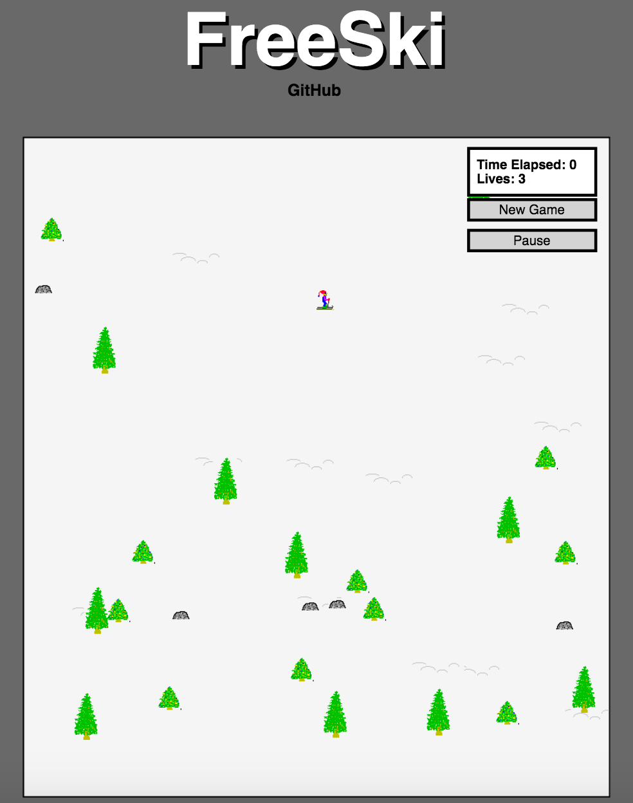
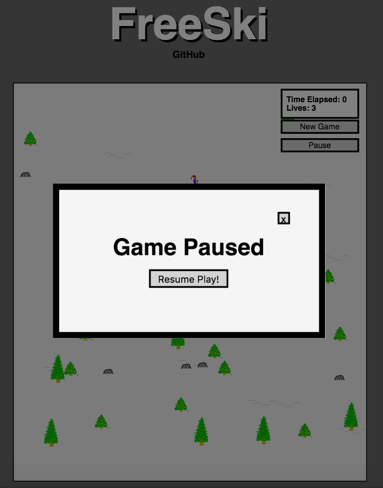

# FreeSki

#### [Play Live][FreeSki]
[FreeSki]: https://abagnard.github.io/FreeSki/

FreeSki is a rendition of the infamous 1990s computer game SkiFree.  
It is written JavaScript and HTML 5 Canvas to create unique, interesting animations and provide a smooth user interface.
___
## How to Play
The goal of this version is to lead the skier down the hill without hitting a tree or a rock. If you can make ski without falling for 60 seconds, you win! If you fall three times, you lose.

* Control the skier using the left, right and down arrow keys.
* Click the buttons on the top right to pause and start a new game.
* Remaining lives and the time elapsed is kept track on the top right of the screen.

___
## Implementation
FreeSki is written in plain javascript utilizing ES6 syntax. Animations and design utilize HTML 5 canvas element and CSS. FreeSki utilizes the keymaster.js library to detect keystrokes and webpack to bundle and serve up the various scripts.

___
### Wireframes:
This app will consist of a single screen with game board and nav links to pause and restart the game and a link to my GitHub. Trees and rocks will be scattered on the game bored with the skier located in the middle of the screen.

Modals appear upon starting a new game, clicking pause button, clicking new game button and when the user wins or loses.

___
## Functionality & MVP
##### With this version of the game, users will be able to:
1.	Change the direction of skiers movement using the arrow keys
2.	Pause and reset the game
3.	Updates lives remaining
4.	Four modals - directions, win game, game over, and pause

## Bonus Features To Come
##### In addition to the features already implemented, I plan to implement the following:
1. Adding the Abominable Snow Monster
2. Adding distance skied. Will determine winner.
